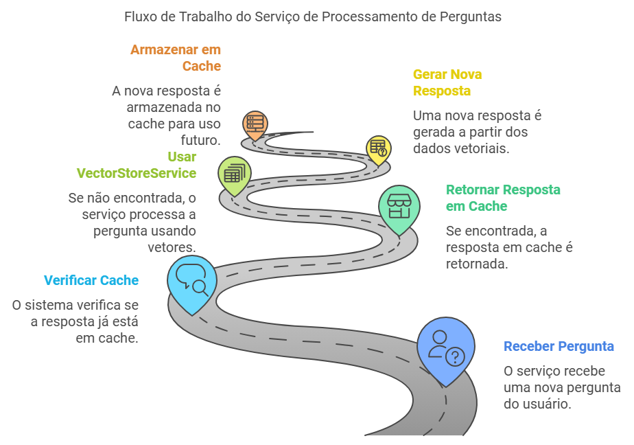

# Serviço de Processamento de Perguntas

Este serviço é responsável por processar perguntas enviadas por usuários, utilizando uma combinação de cache Redis e um sistema de recuperação de informações baseado em vetores. A seguir, detalhamos o funcionamento e os componentes principais deste serviço.

## Componentes Principais:
1. **RedisCacheService**: Utilizado para armazenar e recuperar respostas em cache, melhorando a eficiência ao evitar processamento desnecessário de perguntas já respondidas.

2. **HistoryService**: Armazena o histórico de conversas de cada usuário, permitindo a recuperação de interações passadas. Isso é útil para manter o contexto em conversas contínuas.

3. **VectorStoreService**: Gerencia o armazenamento e recuperação de vetores, que são utilizados para encontrar informações relevantes em resposta a perguntas complexas.

4. **QuestionProcessor**: Classe principal que orquestra o processamento de perguntas. Ela verifica o cache para respostas existentes, utiliza o serviço de vetores para gerar novas respostas quando necessário, e atualiza o histórico de conversas.

## Fluxo de Processamento:
- Ao receber uma pergunta, o serviço primeiro verifica se a resposta já está em cache.
- Se a resposta estiver em cache, ela é retornada imediatamente, junto com o histórico de conversas do usuário.
- Se a resposta não estiver em cache, o serviço utiliza o VectorStoreService para processar a pergunta e gerar uma resposta.
- A nova resposta é então armazenada no cache e o histórico de conversas é atualizado.

Este serviço é projetado para ser eficiente e escalável, utilizando práticas de armazenamento em cache e recuperação de informações para fornecer respostas rápidas e contextualmente relevantes aos usuários.

